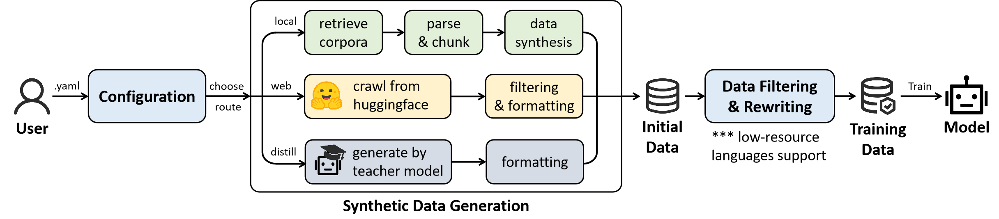

# DataArc SynData Toolkit

*一个模块化、高度易用的合成数据生成工具集，支持多来源、多语言的数据合成。*

### 使用零代码[命令行](#:rocket:-快速开始)与[可视化界面](#:desktop_computer:-可视化界面)，轻松合成大模型训练数据！

:book:[ [English](./README.md) | **中文** ]


## :dart: 项目概述

**DataArc SynData Toolkit**是由数创弧光开发并开源的合成数据工具集，能够根据使用者需求，通过简单配置文件一步到位合成所需训练数据。


## :bulb: 项目特色

- **极简使用**：通过一个[简单指令](#3-合成数据)和一个配置文件合成数据。也提供[可视化界面](#:desktop_computer:-可视化界面)进行操作。
- **支持多来源获取数据**
  - **本地合成**：支持基于本地语料合成数据。
  - **huggingface集成**：支持基于需求自动筛查huggingface数据。 
  - **模型蒸馏**：支持基于模型蒸馏合成数据。
- **支持多语言**：支持英语以及各类小语种。
- **支持多源模型接入**：支持通过本地部署、OpenAI接口等多种形式接入模型。
- **高度可扩展**：合成数据全流程模块化，开发者可灵活基于模块定制化策略和方法实现。

## 🔬 性能表现

| 模型                       | Medical | Finance | Law   |
|----------------------------|---------|---------|-------|
| Qwen-2.5-7B-Instruct       | 42.34%  | 52.91%   | 19.80% |
| Trained with Synthetic Data | 64.57%  | 73.93%  | 42.80% |

仅需少量代码即可带来超过20%的性能提升。

## :notebook: 更新日志

[25/11/17] 我们开源了合成数据平台

> [!TIP]
>
> 如果您无法使用最新的功能，请尝试重新拉取代码


## :factory: DataArc SynData Toolkit 数据合成流程

**DataArc SynData Toolkit**的设计旨在以模块化方式运行数据合成流程，允许用户自定义各模块的策略和方法实现。主要组件包括：

- **数据合成**：通过本地合成、huggingface爬取、数据蒸馏等方法合成数据。
  - 开发者可以继承[BaseTaskConfig](./sdgsystem/configs/config.py)和[BaseTaskExecutor](./sdgsystem/tasks/base.py)定制化合成数据的方法
- **数据筛选与改写**：对初步合成的数据，针对待训练模型进行筛选和改写。
  - 开发者可以继承[BaseRewriteConfig](./sdgsystem/configs/config.py)和[BaseRewriter](./sdgsystem/generation/rewriter.py)定制化数据改写方法（或不改写）



通过解耦模块，开发者可以基于特定需求实现各功能模块的灵活定制化。


## :jigsaw: 使用场景

我们提供三个不同的使用**DataArc SynData Toolkit**进行数据合成的 [使用场景](examples/README.md)。


## :file_folder: 项目结构

```
dataarc-sdg/
├── configs/						# 配置样例
│   ├── example.yaml				# 配置样例YAML文件
|
├── sdgsystem/						# 工具集功能实现
│   ├── configs/					# 配置模块
|	|	├── config.py				# 配置解析
|	|	└── constants.py			# 默认参数
|
│   ├── dataset/					# 数据集模块
|	|	├── dataset.py				# 数据集类
|	|	└── process.py				# 数据处理：质量筛查与格式化
|
│   ├── huggingface/				# huggingface爬取
│   ├── documents/					# 本地文档检索、解析与分块
│   ├── distillation/				# 模型蒸馏
|
│   ├── evaluation/					# 评估模块
|	|	├── answer_comparison.py	# 答案比对
|	|	├── evaluator.py			# 评估器
|
│   ├── generation/					# 生成模块
|	|	├── base.py					# 生成功能基类
|	|	├── generator.py			# 数据合成
|	|	├── rewriter.py				# 数据改写
|
│   ├── models/						# 模型交互模块
|	|	├── postprocess/			# 模型回复后处理模块：如多数投票等
|	|	├── answer_extraction.py	# 答案抽取
|	|	├── models.py				# 模型部署与对话
|	|	├── processor_arguments.py	# 后处理参数
|	|	├── client.py				# 完整模型交互终端
|
│   ├── tasks/						# 数据合成任务执行模块
|	|	├── base.py					# 任务执行器基类
|	|	├── (local/web/distill).py	# 不同来源合成数据的执行
|	|	├── total_executor.py		# 总执行器
|
│   ├── translation/				# 小语种支持
|
│   ├── cli.py						# 项目功能端口
│   ├── pipeline.py					# 工作流程
│   ├── prompts.py					# 提示词
│   ├── token_counter.py			# 大模型token用量估计
│   └── utils.py					# 功能组件
|
├── tests/							# 测试套件
|
├── app.py							# 可视化界面
├── pyproject.toml					# 项目依赖
└── README.md						# 项目文档
```

 

## :rocket: 快速开始

### 1. 安装DataArc SynData Toolkit

```shell
# 1. 克隆项目仓库
git clone https://github.com/DataArcTech/DataArc-SynData-Toolkit.git
cd DataArc-SynData-Toolkit

# 2. 安装uv（如果尚未安装）
pip install uv

# 3. 安装依赖 
uv sync
```

具体的硬件要求以及环境配置请详见[配置文档](DEPENDENCIES.md)。

### 2. 配置

请参照[样例配置文件](./configs/example.yaml)，根据您的需求修改配置。

### 3. 合成数据

通过命令行：

创建.env文件，填写如下字段。
```shell
OPENAI_API_KEY=sk-xxx   # 你的api key
OPENAI_BASE_URL=https://api.openai.com/v1  # 可选：指定的base url
```

并执行如下命令。

```shell
uv run sdg configs/example.yaml  # 可以更改为你的.yaml文件
```


## :desktop_computer: 可视化界面

使用如下命令启动UI界面，该界面由[Gradio](https://github.com/gradio-app/gradio)驱动。

```shell
uv run python app.py
```


## :wrench: 配置系统

数据合成平台使用一个灵活的[YAML文件](./configs/example.yaml)进行配置：


## :date: 下一步发布的计划

- **阿拉伯语支持**：支持合成阿拉伯语训练数据。
- **自定义数据源**：支持自定义地添加数据来源以及对应协议文件的转换。
- **模型微调模块**：支持在工具集流程中，使用合成数据对模型进行微调。


## :handshake: 欢迎贡献

我们欢迎对我们的开源框架进行改进贡献！

