# 使用案例

我们提供三个不同领域的合成数据平台使用案例并展示所使用的配置以及生成的数据样例。

## 1. 数学 QA（Math QA）

###  背景

数学推理任务是衡量大模型基础逻辑能力与多步思考能力的核心指标。在公开数据集中，高质量的数学文字题数量有限，且难以覆盖多步骤、结构化推理场景。

我们的合成数据平台通过“任务定义 + 文档抽取 + Web 数据 + 大模型蒸馏”多源管线，自动生成风格一致、可控难度、多样化结构的数学推理数据，生成的数据可后续用于SFT、RL、CoT等训练，构建更强的数学推理模型。

### 任务定义

**Task Instruction**
```
Generate a grade school math word problem that requires multi-step reasoning.
The problem should involve basic arithmetic operations and have a clear answer.
```

**Input Instruction**
```
The input should be a math word problem that requires multi-step reasoning.
```

**Output Instruction**
```
The output should contain a detailed step-by-step reasoning process and a final answer.
Output your final answer after ####.
```

**demo_examples**
```json
{
  "input": "Janet's ducks lay 16 eggs per day. She eats three for breakfast every morning and bakes muffins for her friends every day with four. She sells the remainder at the farmers' market daily for $2 per fresh duck egg. How much in dollars does she make every day at the farmers' market?", 
  "output": "Janet sells 16 - 3 - 4 = 9 duck eggs a day. She makes 9 * 2 = $18 every day at the farmer's market. #### 18"
}
```

### 从文档合成

我们使用数学教科书《Master Math: Solving Word Problems》的pdf文件作为文档，书的内容示例如下图：

<p align="center">
  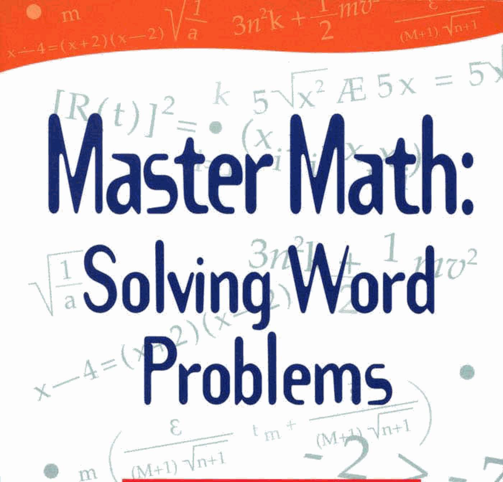
  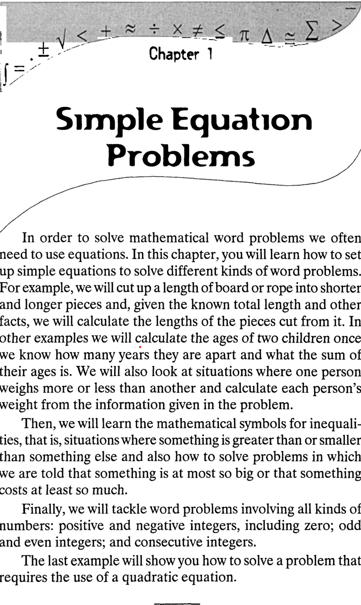
  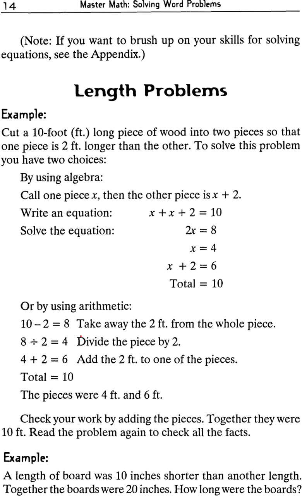
  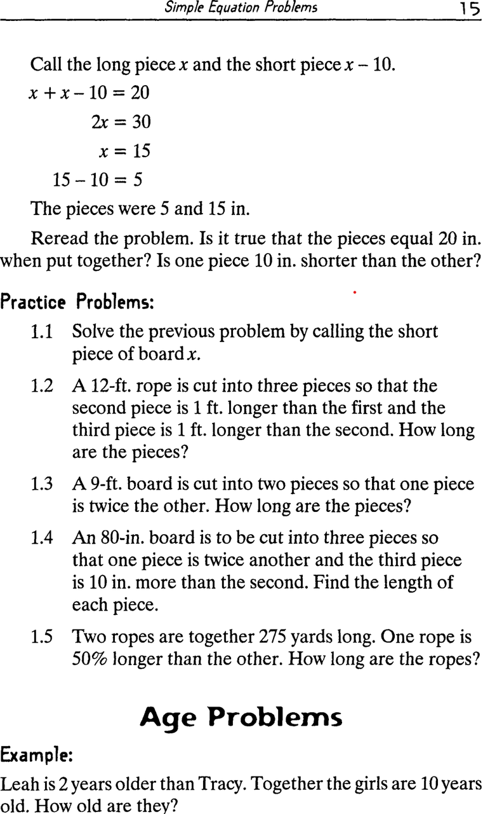
</p>


生成的数据示例如下：

```json
{
  "input": "In a garden, Emily plants 150 flowers of different types: 60 are roses, 45 are tulips, and the rest are sunflowers. After one week, 10% of the roses wilt, and Emily decides to replace them with more tulips. If she buys 25 tulip plants, how many tulips does she have now?", 
  "output": "To solve the problem step by step, let's break down the information given:\n\n1. **Total Flowers**: Emily plants a total of 150 flowers.\n2. **Types of Flowers**:\n   - Roses: 60\n   - Tulips: 45\n   - Sunflowers: To find the number of sunflowers, we subtract the number of roses and tulips from the total:\n     \\[\n     \\text{Sunflowers} = \\text{Total Flowers} - (\\text{Roses} + \\text{Tulips}) = 150 - (60 + 45) = 150 - 105 = 45\n     \\]\n   So, Emily has 45 sunflowers.\n\n3. **Roses Wilting**: After one week, 10% of the roses wilt. To find out how many roses wilt:\n   \\[\n   \\text{Roses Wilting} = 10\\% \\text{ of } 60 = 0.10 \\times 60 = 6\n   \\]\n   Therefore, 6 roses wilt.\n\n4. **Roses Remaining**: The number of roses remaining after wilting is:\n   \\[\n   \\text{Roses Remaining} = \\text{Roses} - \\text{Roses Wilting} = 60 - 6 = 54\n   \\]\n\n5. **Replacing Wilting Roses with Tulips**: Emily decides to replace the 6 wilted roses with tulips. She buys 25 additional tulip plants. To find the total number of tulips now:\n   - Initial tulips: 45\n   - Tulips added: 25\n   \\[\n   \\text{Total Tulips} = \\text{Initial Tulips} + \\text{Tulips Added} = 45 + 25 = 70\n   \\]\n\nThus, after replacing the wilted roses with tulips, Emily now has a total of 70 tulips.\n\nFinal answer: ####70"
}
```

### Web 爬取

如果没有相关文档，我们的合成数据平台可以从开源平台（huggingface）爬取相关数据。生成的数据示例如下：

```json
{
  "input": "Read the questions and answers carefully, and choose the one you think is appropriate among the three options A, B and C. Q: The owner of the snack shop said that for a special occasion, he would give out cookies equal to the three-digit number made by using 1, 7, and 0 all at least once. What number should Haneul make to receive the most sweets? CHOICES: A: 710, B: 701, C: 170", 
  "output": "<think>To receive the most sweets, Haneul needs to create the largest possible three-digit number using the digits 1, 7, and 0, with each digit used at least once. The hundreds place should have the largest digit (7), the tens place should have the next largest digit (1), and the ones place should have the smallest digit (0). This gives us 710. Comparing the options: A: 710, B: 701, C: 170. Among these, 710 is the largest number.</think> <answer>A</answer>"
}
```

### 大模型蒸馏

除了从开源平台爬取相关数据，我们的合成数据平台同时支持仅从大模型中蒸馏数据。生成的数据示例如下：

```json
{
  "input": "Eric is organizing a fundraiser and has 75 items to sell. He sells 20% of the items during the first day, then he donates 10 items to a local charity. The next day, he receives a donation of 30 more items. How many items does Eric have left to sell at the end?", 
  "output": "Let's break down the problem step by step:\n\n1. **Initial number of items**: Eric starts with 75 items.\n\n2. **Items sold on the first day**: He sells 20% of the items.\n   - 20% of 75 = 0.20 * 75 = 15 items.\n   - After selling 15 items, the number of items left is:\n     - 75 - 15 = 60 items.\n\n3. **Items donated to charity**: Eric donates 10 items.\n   - After the donation, the number of items left is:\n     - 60 - 10 = 50 items.\n\n4. **Items received as a donation**: The next day, he receives 30 more items.\n   - After receiving the donation, the number of items becomes:\n     - 50 + 30 = 80 items.\n\nNow, we can summarize the final count of items Eric has left to sell:\n\nEric has 80 items left to sell at the end.\n\n#### 80"
}
```

---

## 2. 金融 QA（CFA QA）

### 背景

金融领域的专业问答数据通常受版权、付费壁垒和机构限制，公开可用的高质量 CFA 风格题目极其稀缺。同时，金融概念体系庞大、术语多、跨场景依赖复杂，难以通过简单规则生成高质量数据。

我们的合成数据平台通过解析权威教材内容、检索关键知识点，并结合大模型推理能力自动生成结构严谨、风格一致的金融 QA 数据。该类数据可用于构建金融助手、投资教育问答系统、解释型模型以及模型专业性强化训练。

### 任务定义

**Task Instruction**
```
Generate a CFA-style finance question that requires understanding and applying core investment and financial concepts.
The question should have one correct answer.
```

**Input Instruction**
```
Follow this format: 'Read the questions and answers carefully, 
and choose the one you think is appropriate among the three options A, B and C.' 
then Q:[Your question here] CHOICES: A: ...,B: ...,C: ...
```

**Output Instruction**
```
Your output should contain thinking process and a single answer, the thinking process should be enclosed within <think> </think>, i.e., <think> thinking process here </think>. 
Your answer should be an option only and be enclosed within <answer> </answer> tags, i.e., <answer> a single option here </answer>.
```

**demo_examples**
```json
{
  "input": "Read the questions and answers carefully, and choose the one you think is appropriate among the three options A, B and C.\nQ:Disinflation is best described as a:,CHOICES: A: decline in price levels.,B: negative inflation rate.,C: decline in the inflation rate. Answer:", 
  "output": "C"
}
```

### 从文档合成

我们使用了cfa考试的教科书《CFA Program Curriculum 2025 Level I》的pdf文件作为文档，书的内容示例如下图：

<p align="center">
  
  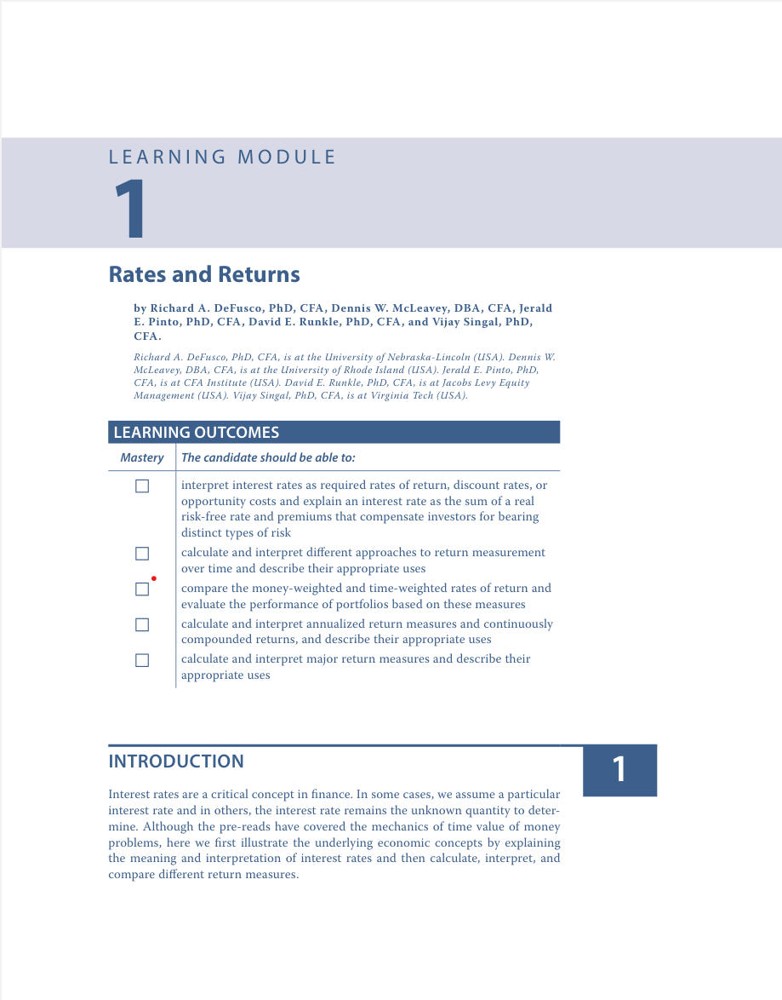
  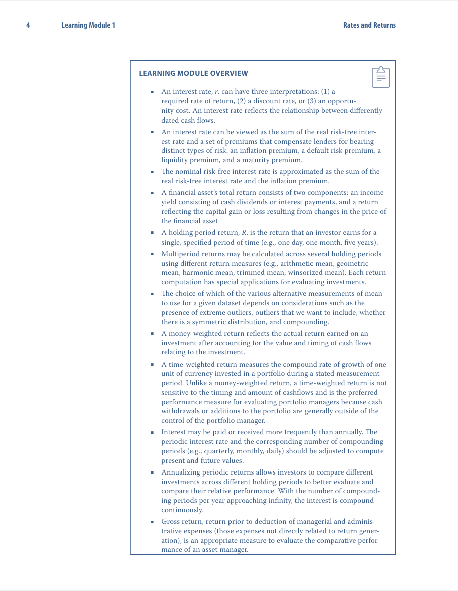
  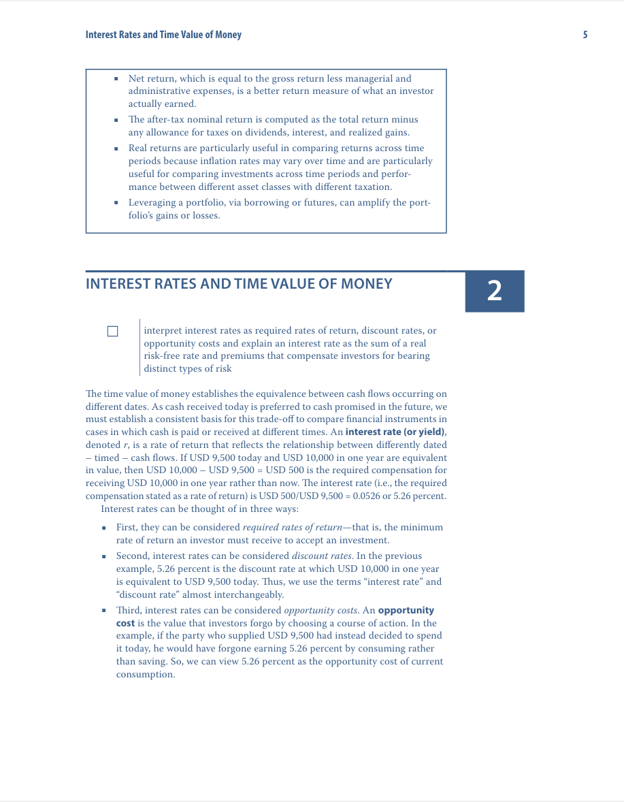
</p>

生成的数据示例如下：

```json
{
  "input": "Read the questions and answers carefully, and choose the one you think is appropriate among the three options A, B and C.\nQ:In the context of investment risk assessment, which of the following statements accurately describes the relationship between volatility and expected returns over different time horizons?,CHOICES: A: Higher short-term volatility guarantees higher long-term returns, B: Short-term volatility can lead to increased uncertainty about long-term returns, C: Long-term investments always weather short-term volatility without affecting overall returns. Answer:", 
  "output": "<think> To assess the relationship between volatility and expected returns, we need to consider how short-term fluctuations can impact long-term investment outcomes. Option A suggests a guarantee of higher long-term returns with higher short-term volatility, which is misleading as volatility does not ensure returns. Option C implies that long-term investments are immune to short-term volatility, which is also inaccurate since short-term volatility can influence investor behavior and market conditions, potentially affecting long-term returns. Option B, however, accurately reflects that short-term volatility introduces uncertainty regarding long-term returns, making it the most appropriate choice. </think> <answer> B </answer>"
}
```

### Web 爬取
```json
{
  "input": "Read the questions and answers carefully, and choose the one you think is appropriate among the three options A, B and C.\nQ:Which of the following risk premiums is most relevant in explaining the difference in yields between 30-year bonds issued by the US Treasury and 30-year bonds issued by a small private issuer? CHOICES: A: Inflation,B: Maturity,C: Liquidity Answer:", 
  "output": "<think>The question asks about the most relevant risk premium explaining yield differences between 30-year US Treasury bonds and 30-year bonds from a small private issuer. Both bonds have the same maturity (30 years), so maturity risk premium isn't the key difference. Inflation risk would affect both similarly. The main difference is that US Treasury bonds are highly liquid and considered risk-free, while bonds from small private issuers are less liquid and carry higher default risk. The yield difference primarily reflects the liquidity premium that investors demand for holding less liquid private bonds.</think> <answer>C</answer>"
}
```

### 大模型蒸馏
```json
{
  "input": "Read the questions and answers carefully, and choose the one you think is appropriate among the three options A, B and C. Q: A bond is rated 'BB' by a credit rating agency. Considering this rating, what are the potential implications for an investor looking to include this bond in their portfolio?,CHOICES: A: The bond is considered investment-grade and is a low-risk option for conservative investors.,B: The bond is classified as speculative; therefore, it carries a higher default risk and may offer attractive yields but requires careful consideration.,C: The bond has a very high investment-grade rating and is expected to provide steady and predictable returns. Answer:", 
  "output": "<think> The bond rated 'BB' is below the investment-grade threshold, which typically starts at 'BBB-' or higher. This indicates that the bond is considered speculative and carries a higher risk of default compared to investment-grade bonds. Investors may be attracted to such bonds due to potentially higher yields, but they should be aware of the increased risk. Therefore, option B accurately reflects the implications of a 'BB' rating for an investor. </think> <answer> B </answer>"
}
```

---

## 3. 医疗 QA（MedQA）

### 背景

医学考试（如 USMLE / MedQA）题库具有强版权限制，且真实病例数据涉及隐私、合规与伦理问题，导致公开医学 QA 数据稀缺且覆盖不足。模型在医疗场景中需要严格的事实性与临床推断能力，因此可控、可审计的合成数据尤为重要。

我们的合成数据平台基于医学教材、以及大模型能力，自动生成无隐私风险、格式统一的医学 QA 数据，可用于构建临床问答系统、医学推理模型和安全可控的医疗 AI 训练样本。

### 任务定义

**Task Instruction**
```
Generate a MedQA-style medical question that requires medical knowledge and clinical reasoning,
with one correct answer.
```

**Input Instruction**
```
Provide clinical vignettes including patient demographics, symptoms, lab results, and
a USMLE-style multiple-choice question with four options.
```

**Output Instruction**
```
Your output should contain the thinking process enclosed within <think> </think> 
and the final answer enclosed within <answer> </answer>.
```

**demo_examples**
```json
{
  "input": "A 3-month-old baby died suddenly at night while asleep. His mother noticed that he had died only after she awoke in the morning. No cause of death was determined based on the autopsy. Which of the following precautions could have prevented the death of the baby?,OPTIONS: A: Placing the infant in a supine position on a firm mattress while sleeping.,B: Routine postnatal electrocardiogram (ECG).,C: Keeping the infant covered and maintaining a high room temperature.,D: Application of a device to maintain the sleeping position.,E:Avoiding pacifier use during sleep. Answer:", 
  "output": "<think>This is classic SIDS. The strongest proven preventive measure is placing infants supine on a firm mattress. The other options either increase risk or have no proven benefit.</think> <answer>A</answer>"
}
```

### 从文档合成

我们使用了医疗急救教科书《First Aid for the USMLE Step 1 2017》的pdf文件作为文档，书的内容示例如下图：

<p align="center">
  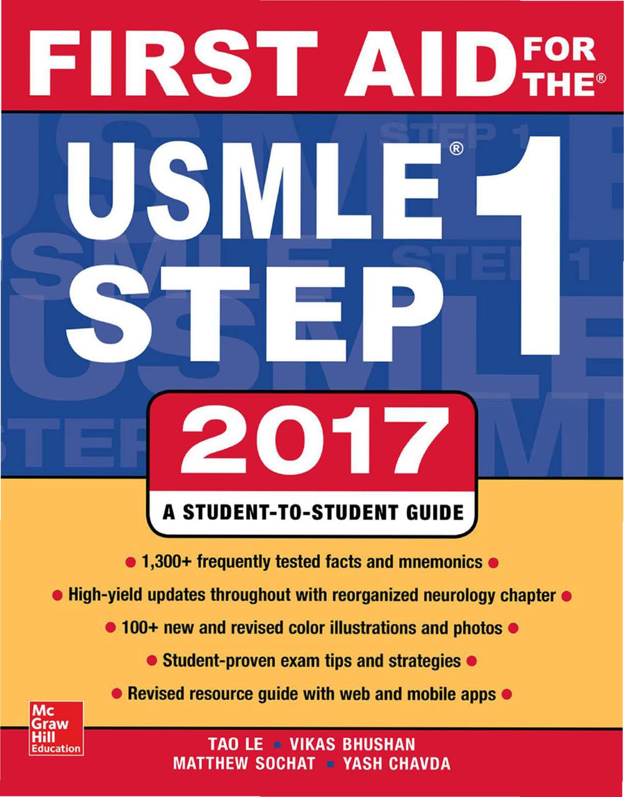
  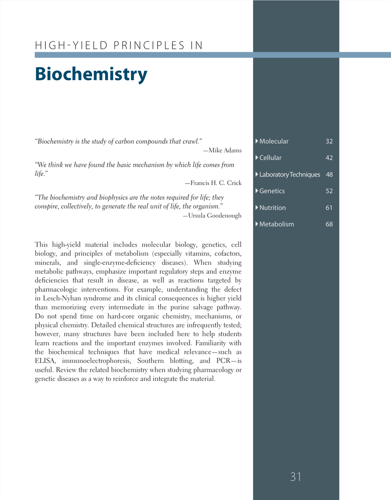
  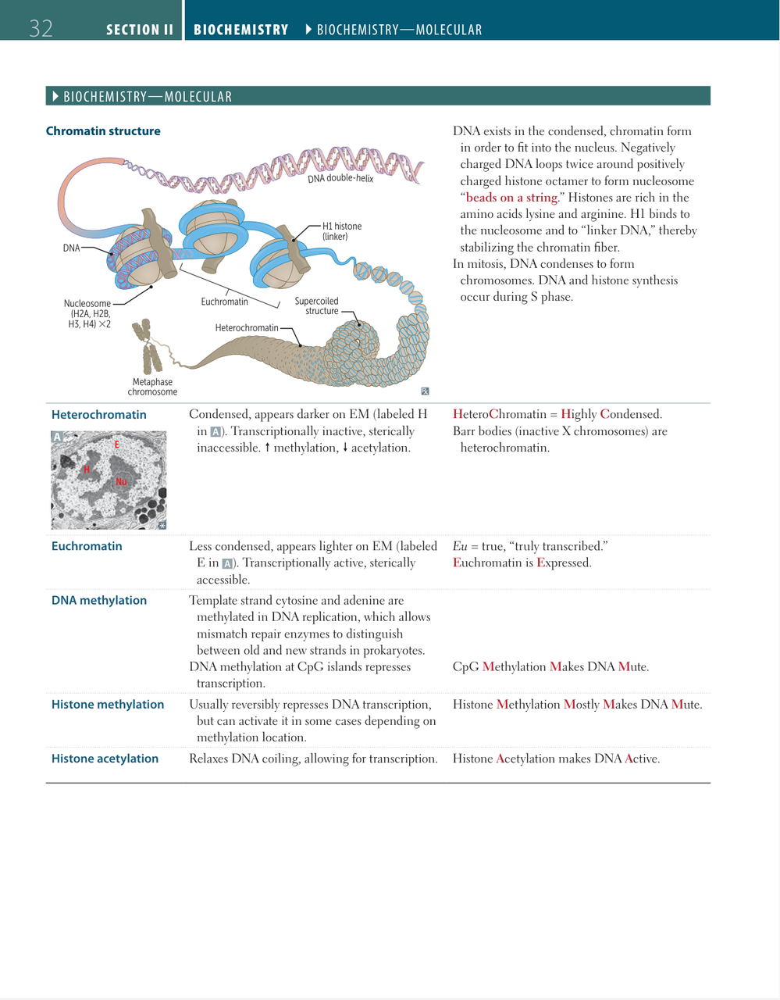
  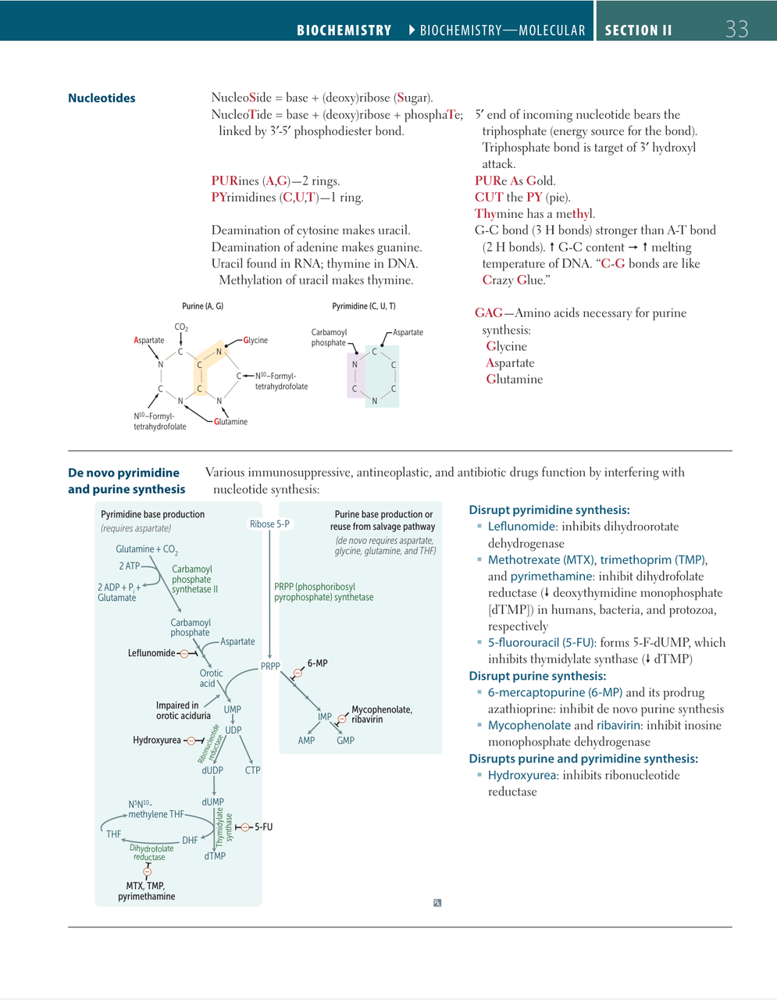
</p>

生成的数据示例如下：

```json
{
  "input": {"clinical_vignette": {"patient_demographics": "A 72-year-old female", "medical_history": "Type 2 diabetes mellitus, chronic kidney disease stage 3, previous myocardial infarction 5 years ago, and moderate obesity", "symptoms_and_signs": "She presents with new-onset shortness of breath on exertion, dizziness, and swelling in her lower extremities over the past two weeks. On examination, her blood pressure is 160/90 mmHg, and she has elevated jugular venous pressure.", "lab_or_imaging_results": "Chest X-ray reveals signs of congestive heart failure with fluid overload and cardiomegaly. Brain natriuretic peptide (BNP) is significantly elevated.", "progression_or_complication": "She has required increasing doses of diuretics over the last week, but her symptoms have persistently worsened."}, "question": "What is the most likely diagnosis for this patient?", "options": ["A) Acute coronary syndrome", "B) Decompensated heart failure", "C) Pulmonary hypertension", "D) Acute respiratory distress syndrome"]}, 
  "output": "<think> The patient is a 72-year-old female with a history of type 2 diabetes, chronic kidney disease, and previous myocardial infarction. She presents with new-onset shortness of breath, dizziness, and lower extremity swelling, which are indicative of fluid overload. The elevated blood pressure and jugular venous pressure, along with the chest X-ray findings of congestive heart failure and elevated BNP levels, strongly suggest heart failure. The worsening symptoms despite increasing diuretic doses further support the diagnosis of decompensated heart failure rather than other options like acute coronary syndrome, pulmonary hypertension, or acute respiratory distress syndrome. </think> <answer> B) Decompensated heart failure </answer>"
}
```

### Web 爬取
```json
{
  "input": "Clinical Vignette: A 3-month-old baby died suddenly at night while asleep. His mother noticed that he had died only after she awoke in the morning. No cause of death was determined based on the autopsy.\n\nQuestion: Which of the following precautions could have prevented the death of the baby?\n\nOptions:\nA. Placing the infant in a supine position on a firm mattress while sleeping\nB. Keeping the infant covered and maintaining a high room temperature\nC. Application of a device to maintain the sleeping position\nD. Avoiding pacifier use during sleep", 
  "output": "<think>This clinical vignette describes a case of sudden infant death syndrome (SIDS) in a 3-month-old baby who died during sleep. The autopsy revealed no specific cause of death, which is characteristic of SIDS. The key risk factors for SIDS include prone sleeping position, soft bedding, overheating, and bed-sharing. Among the options:\n- Option A (supine position on firm mattress) aligns with the American Academy of Pediatrics' \"Back to Sleep\" recommendations for SIDS prevention.\n- Option B (keeping covered with high room temperature) would increase the risk of overheating, a known SIDS risk factor.\n- Option C (device to maintain sleeping position) is not recommended as positional devices can be hazardous.\n- Option D (avoiding pacifier) is actually protective against SIDS, though the question asks which precaution \"could have prevented\" the death, and supine positioning is the most established preventive measure.\n\nThe scenario strongly suggests SIDS, and placing infants supine on a firm mattress is the most evidence-based preventive measure.</think>\n<answer>A</answer>"
}
```

### 大模型蒸馏
```json
{
  "input": "A 28-year-old female presents to the clinic with increased thirst and urination over the last two weeks. She has experienced fatigue and slight weight loss. Her blood glucose level is measured at 200 mg/dL during the visit. What is the most likely underlying mechanism contributing to her symptoms? \n\nA) Beta-cell destruction due to autoimmune reaction \nB) Insulin resistance in peripheral tissues \nC) Increased hepatic glucose production \nD) Impaired renal glucose reabsorption", 
  "output": "<think> The patient is a 28-year-old female presenting with symptoms consistent with hyperglycemia, including increased thirst, urination, fatigue, and weight loss. The blood glucose level of 200 mg/dL indicates that she is likely experiencing diabetes. Given her age and the acute presentation of symptoms, type 1 diabetes mellitus is a strong possibility, which is characterized by autoimmune destruction of pancreatic beta cells leading to insulin deficiency. This would align with option A. \n\nOption B, insulin resistance, is more typical of type 2 diabetes, which usually occurs in older individuals and is associated with obesity. Option C, increased hepatic glucose production, can occur in both types of diabetes but is not the primary mechanism in this case. Option D, impaired renal glucose reabsorption, would lead to glucosuria but does not explain the underlying cause of her symptoms. Therefore, the most likely underlying mechanism contributing to her symptoms is beta-cell destruction due to an autoimmune reaction. </think> \n\n<answer> A </answer>"
}
```
